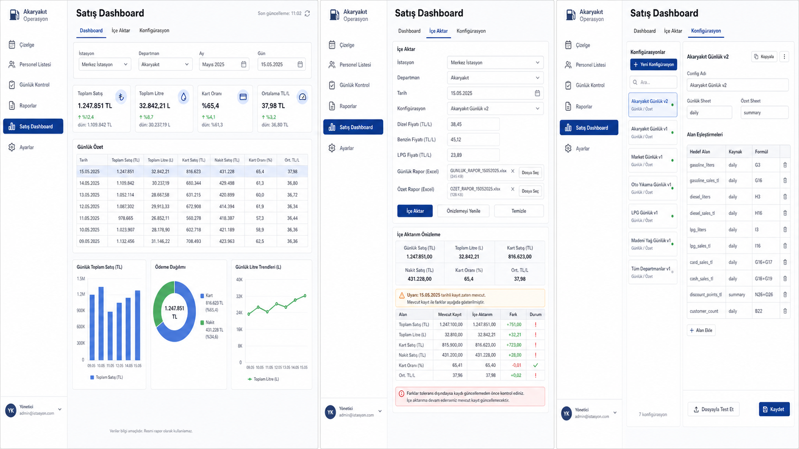

# Feature Dashboard Plan

Son guncelleme: 2026-06-16

Bu dokuman, mevcut Vardiya Yonetimi projesine eklenecek `Satis Dashboard`
gelistirmesinin urun, ekran, veri modeli ve teknik uygulama planini tanimlar.

## Ozet

`Satis Dashboard` sol menude ayri bir ekran olarak eklenecek ve uc sekmeden
olusacak:

- `Dashboard`
- `Ice Aktar`
- `Konfigurasyon`

Kullanici isimli bir import konfigurasyonu sececek, `Gunluk Rapor` ve `Ozet`
Excel dosyalarini yukleyecek, istasyon/departman/tarih ve manuel fiyat
alanlarini girecek. Sistem konfigurasyondaki hucre/formul mapping'ine gore
veriyi okuyacak, preview uretecek ve kullanici onaylarsa veriyi Supabase'e
yazacak.

Mevcut FE + Supabase mimarisi korunacak. Backend kaynagi Supabase olmaya devam
edecek.

## Kararlar

- DB degisiklikleri SQL migration olarak repo'ya eklenecek.
- Codex, Supabase MCP ile migration'i remote DB'ye uygulayabilecek.
- Excel parse ve import preview on yuzde yapilacak.
- Import preview DB'ye yazilmayacak.
- Audit kaydi sadece kullanici `Uygula` dediginde olusacak.
- Import apply adimi tek Supabase RPC ile yapilacak.
- Grafikler ilk surumde yeni chart dependency olmadan native CSS/SVG
  bilesenleriyle yapilacak.
- RLS bu gelistirme kapsaminda degil.
- Excel dosyalarinin kendisi saklanmayacak.
- Custom metrik ekleme ilk surum kapsaminda degil.

## Tasarim Referansi

Ana gorsel referans:



Tasarim yonu:

- Mevcut acik tema korunacak.
- Sol menu yapisi korunacak.
- Operasyonel, kompakt ve okunabilir dashboard yogunlugu hedeflenecek.
- Config ekrani modal degil, tam sekme olacak.
- Kartlar, tablolar ve filtreler mevcut tasarim sistemiyle uyumlu olacak.

## Kullanilacak Teknolojiler ve Supabase Ozellikleri

Mevcut stack korunacak:

- React + Vite + TypeScript
- `xlsx`
- `@supabase/supabase-js`

Supabase/Postgres tarafinda kullanilacak ozellikler:

- `jsonb`: config mapping, config snapshot, parsed values, warnings ve changed
  fields icin kullanilacak. Ana dashboard metrikleri kolon olarak tutulacak.
- Postgres RPC / Database Function: import apply islemini tek cagrida atomik
  yapmak icin kullanilacak.
- `upsert + unique constraint`: ayni istasyon + departman + tarih icin update
  akisini destekleyecek.
- Postgres Views: dashboard KPI ve grafik datasini merkezi hesaplamak icin
  kullanilacak.

Codex + Supabase bakim workflow'u:

- DB degisiklikleri SQL migration olarak repo'da tutulacak.
- Codex once mevcut schema'yi okuyup migration hazirlayabilecek.
- Supabase MCP ile migration uygulanabilecek.
- Gerekirse Supabase TypeScript tipleri yeniden uretilebilecek.

Referanslar:

- [Supabase JSON/JSONB](https://supabase.com/docs/guides/database/json)
- [Supabase RPC](https://supabase.com/docs/reference/javascript/rpc)
- [Supabase Upsert](https://supabase.com/docs/reference/javascript/upsert)
- [Supabase Tables / Views](https://supabase.com/docs/guides/database/tables)

## Ekran Yapisi

### Sol Menu

Sol menuye yeni item eklenecek:

- `Satis Dashboard`

### Dashboard Sekmesi

Filtreler:

- Istasyon
- Departman
- Ay
- Opsiyonel gun secimi

KPI kartlari:

- Toplam Satis
- Toplam Litre
- Kart Orani
- Ortalama TL/L

Tablolar ve grafikler:

- Gunluk ozet tablo
- Yakit litre tablosu
- Gunluk Toplam Satis line chart
- Odeme Dagilimi bar chart
- Gunluk Litre Trendleri line chart

### Ice Aktar Sekmesi

Form alanlari:

- Istasyon
- Departman
- Tarih
- Aktif konfigurasyon dropdown
- Dizel fiyati
- Benzin fiyati
- LPG fiyati
- Gunluk rapor dosyasi
- Ozet rapor dosyasi

Preview paneli:

- Parse edilen degerler
- Uyarilar
- Mevcut kayit varsa eski/yeni farklari
- Uygula aksiyonu

### Konfigurasyon Sekmesi

Sol taraf:

- Config listesi
- Config durumlari
- System config isareti

Sag taraf:

- Config adi
- Gunluk sheet adi
- Ozet sheet adi
- Mapping tablosu
- `Kopyala`
- `Kaydet`
- `Dosyayla Test Et`
- Aktif/Pasif aksiyonu

Mapping tablosu kolonlari:

- Hedef Alan
- Kaynak
- Formul

Import dropdown meta ornegi:

```text
Umraniye Akaryakit - Standart · Gunluk: Sayfa1 · Ozet: ilk sayfa
```

## Veri Modeli

### `sales_import_configs`

```sql
create table if not exists sales_import_configs (
  id bigint primary key generated always as identity,
  name text not null,
  status text not null
    constraint sales_import_configs_status_check
    check (status in ('draft', 'active', 'inactive')),
  is_system boolean not null default false,
  daily_sheet_name text,
  summary_sheet_name text,
  mappings jsonb not null,
  created_at timestamptz not null default now(),
  updated_at timestamptz not null default now()
);
```

### `sales_daily_reports`

```sql
create table if not exists sales_daily_reports (
  id bigint primary key generated always as identity,
  station_id integer not null references stations(id),
  dept_id integer not null references departments(id),
  report_date date not null,

  gasoline_liters numeric(14,2) not null,
  diesel_liters numeric(14,2) not null,
  lpg_liters numeric(14,2) not null,
  total_liters numeric(14,2) not null,

  total_sales_tl numeric(14,2) not null,
  discount_points_tl numeric(14,2) not null,
  card_sales_tl numeric(14,2) not null,
  cash_sales_tl numeric(14,2) not null,
  tts_tl numeric(14,2) not null,
  partner_tl numeric(14,2) not null,
  gift_tl numeric(14,2) not null,
  fault_form_tl numeric(14,2) not null,
  company_tl numeric(14,2) not null,
  alioglu_tl numeric(14,2) not null,

  diesel_unit_price numeric(10,4) not null,
  gasoline_unit_price numeric(10,4) not null,
  lpg_unit_price numeric(10,4) not null,
  calculated_sales_tl numeric(14,2) not null,

  source_report_date date,
  last_import_run_id bigint,
  created_at timestamptz not null default now(),
  updated_at timestamptz not null default now(),

  unique (station_id, dept_id, report_date)
);
```

### `sales_import_runs`

```sql
create table if not exists sales_import_runs (
  id bigint primary key generated always as identity,
  sales_daily_report_id bigint references sales_daily_reports(id),
  config_id bigint references sales_import_configs(id),
  station_id integer not null references stations(id),
  dept_id integer not null references departments(id),
  report_date date not null,

  daily_file_name text not null,
  summary_file_name text not null,
  config_snapshot jsonb not null,
  parsed_values jsonb not null,
  previous_values jsonb,
  changed_fields jsonb,
  warnings jsonb not null,
  status text not null
    constraint sales_import_runs_status_check
    check (status in ('applied', 'failed')),
  error_message text,
  imported_at timestamptz not null default now()
);
```

### Indeksler

```sql
create unique index if not exists sales_daily_reports_scope_date_unique
  on sales_daily_reports(station_id, dept_id, report_date);

create index if not exists sales_daily_reports_report_date_idx
  on sales_daily_reports(report_date);

create index if not exists sales_import_runs_report_date_idx
  on sales_import_runs(report_date);

create index if not exists sales_import_runs_config_id_idx
  on sales_import_runs(config_id);
```

## DB Interface

### RPC

RPC adi:

```text
apply_sales_import
```

FE preview tamamlandiktan sonra kullanici onayiyla cagrilir.

RPC icinde:

1. Mevcut rapor satiri okunur.
2. `sales_daily_reports` insert/update yapilir.
3. `sales_import_runs` audit kaydi olusturulur.
4. `sales_daily_reports.last_import_run_id` guncellenir.

### View'lar

Dashboard icin view'lar:

- `sales_dashboard_daily_view`
- `sales_dashboard_monthly_view`

`sales_dashboard_daily_view` gunluk normalize veri ve hesap alanlarini dondurur.

`sales_dashboard_monthly_view` ay bazli KPI toplamlarini ve oranlarini dondurur.

## Konfigurasyon

Config ornekleri:

- `Umraniye Akaryakit - Standart`
- `Sile Akaryakit - Standart`

Config davranislari:

- Import sirasinda config her seferinde dropdown'dan manuel secilecek.
- Config istasyon/departmana kilitli olmayacak.
- Ayni config farkli yerlerde kullanilabilecek.
- Seed/system config silinemez.
- Seed/system config dogrudan duzenlenemez.
- Kullanici system config'i kopyalayip kendi config'ini olusturabilir.

Config durumlari:

- `draft`: kaydedilebilir ama importta kullanilamaz.
- `active`: import dropdown'inda gorunur.
- `inactive`: saklanir ama importta gorunmez.

Aktivasyon kurallari:

- Tum zorunlu hedef alanlar mapping'e sahip olmali.
- Tum formuller whitelist parser'dan gecmeli.
- Hatali/eksik config kaydedilebilir, ama `active` yapilamaz.

Sheet kurali:

- `daily_sheet_name` bos ise gunluk dosyada ilk sheet okunur.
- `daily_sheet_name` dolu ise belirtilen sheet zorunludur.
- `summary_sheet_name` bos ise ozet dosyada ilk sheet okunur.
- `summary_sheet_name` dolu ise belirtilen sheet zorunludur.

## Mapping ve Hesaplar

Ilk surumde hedef alanlar sabit olacak. Kullanici yeni metrik alani
eklemeyecek, sadece mevcut satis alanlarinin kaynak hucre/formulunu
duzenleyecek.

Seed config:

```text
daily.G1        -> source_report_date
daily.G3        -> gasoline_liters
daily.G4        -> diesel_liters
daily.G5        -> lpg_liters
daily.C16       -> total_sales_tl
daily.G16+G17   -> card_sales_tl
daily.C42       -> cash_sales_tl
daily.C21       -> tts_tl
daily.C22       -> partner_tl
daily.C23       -> gift_tl
daily.C24       -> fault_form_tl
daily.C25       -> company_tl
daily.C26       -> alioglu_tl
summary.N26+O26 -> discount_points_tl
```

Mini formul evaluator whitelist:

```text
Desteklenen:
- hucre referansi
- sayi
- + - * /
- parantez

Desteklenmeyen:
- SUM
- IF
- Excel fonksiyonlari
- sheet referansi
- dis dosya referansi
- metin operatoru
- serbest JS
```

Dashboard hesaplari config'e baglanmayacak:

```text
total_liters = gasoline_liters + diesel_liters + lpg_liters

calculated_sales_tl =
  diesel_unit_price * diesel_liters +
  gasoline_unit_price * gasoline_liters +
  lpg_unit_price * lpg_liters
```

## Import Akisi

1. Kullanici istasyon, departman, tarih ve aktif config secer.
2. Kullanici gunluk rapor ve ozet rapor dosyalarini secer.
3. Kullanici dizel, benzin ve LPG fiyatlarini girer.
4. Sistem preview uretir.
5. Preview'da parse edilen degerler, uyarilar ve mevcut kayit farklari
   gosterilir.
6. Kullanici onaylarsa FE tek bir RPC cagrisi yapar.
7. RPC icinde rapor satiri insert/update edilir ve audit kaydi olusur.

## Validasyon

Bloklayici kontroller:

- Eksik config
- Eksik dosya
- Eksik fiyat
- Hatali formul
- Eksik zorunlu mapping
- Okunamayan hucre

Uyarilar:

- Kullanici tarihi ile `daily.G1` uyusmuyorsa.
- Ozet tarih araligi parse edilebilirse ve kullanici tarihiyle uyusmuyorsa.
- Ayni istasyon/departman/tarih icin mevcut kayit varsa.

## Test Plani

Seed config ile `tmp-analysis/gunluk.xlsx` ve `tmp-analysis/ozet.xls` parse
edilecek.

Beklenen degerler:

```text
fault_form_tl = 0
company_tl = 3756.57
discount_points_tl = 9861.11
total_liters = 31144.10
total_sales_tl = 2064817.77
```

Test senaryolari:

- Yanlis sheet adi bloklanir.
- Hatali formul bloklanir.
- Eksik fiyat bloklanir.
- Eksik dosya bloklanir.
- Tekrar import update akisi calisir.
- RPC audit kaydi, config snapshot, warnings ve changed fields dogrulanir.
- Dashboard view'lari beklenen aylik/gunluk degerleri dondurur.
- Son dogrulama: `npm.cmd run build`.

## Varsayimlar

- Dashboard Excel import edilmeyecek.
- Dashboard DB verisinden uretilecek.
- Excel dosyalarinin kendisi saklanmayacak.
- Custom metrik ekleme ilk surum kapsaminda olmayacak.
- RLS bu planin kapsami disindadir.
