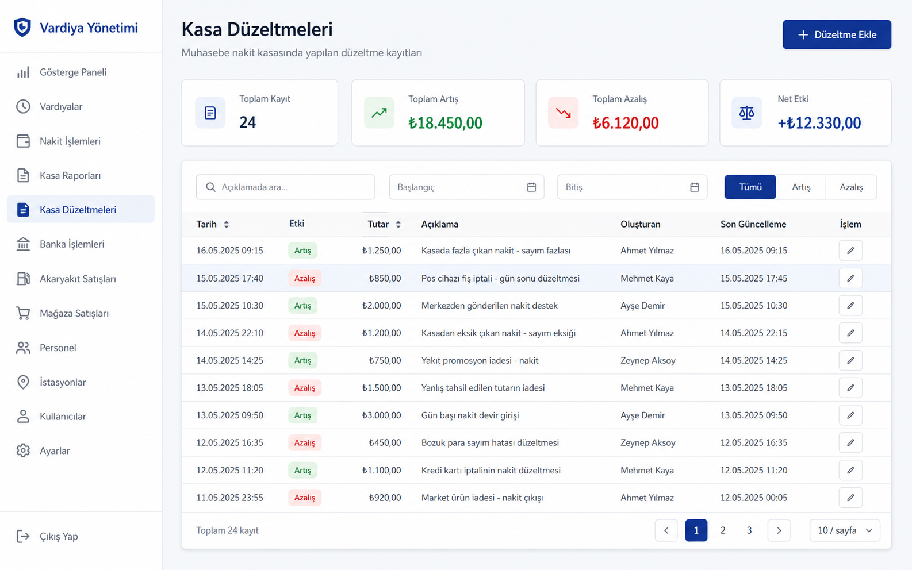
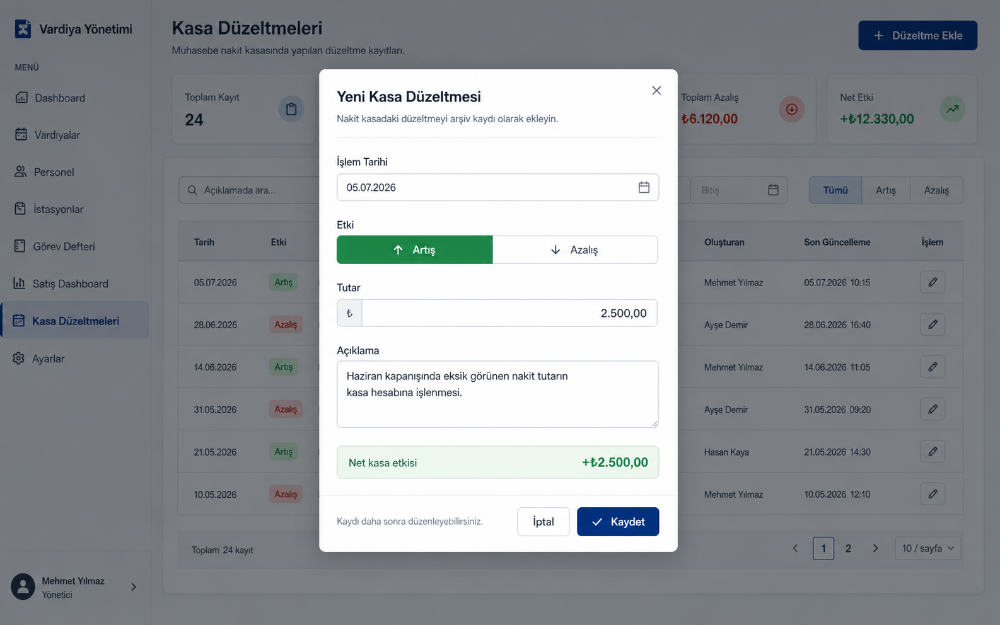

# Kasa Düzeltmeleri Codex Handoff Paketi

Bu paket, bu konuşmadaki ürün kararlarını ve onaylanan görsel yönü başka bir Codex'e aktarmak için hazırlandı.

## Kısa Bağlam

Repo: `C:\VSCode\shift-manager`

Uygulama, Türkçe bir akaryakıt işletmesi operasyon paneli. Stack: React 18, TypeScript, Vite, Supabase Auth ve PostgreSQL. Mevcut UI dili sade operasyon dashboard'u: sol sidebar, açık slate arka plan, beyaz kartlar, tablo yoğunluğu, navy primary renk.

Kullanıcı yeni bir ekran istedi:

> Muhasebe'de kullanılan nakit kasada yapılan düzeltmeleri personel için loglamak. Dönem dönem işletmenin nakit kasası için düzeltme işlemi yapılıyor; amaç geriye dönük arşiv tutup o dönem yapılan işlemi hatırlamak.

Onaylanan ekran adı: **Kasa Düzeltmeleri**

## Kabul Edilen Ürün Kararları

- Kayıtlar genel muhasebe nakit kasası içindir.
- İstasyon veya departman alanı tutulmayacak.
- Tutar modeli: `Artış/Azalış + pozitif TL tutarı`.
- Neden kategorisi tutulmayacak, yalnızca serbest `Açıklama` alanı olacak.
- Tarih modeli: yalnızca `İşlem Tarihi`.
- Kayıtlar sonradan düzenlenebilir.
- Audit alanları tutulacak: `created_by`, `updated_by`, `created_at`, `updated_at`.
- v1 kapsamında silme veya arşivleme yok.
- Bu ekran satış dashboard verilerini veya `cash_sales_tl` alanını otomatik değiştirmeyecek. Sadece arşiv/audit kaydıdır.

## Görsel Referanslar

Ana ekran mockup:



Modal mockup:



Orijinal oluşturulan görseller:

- `C:\Users\mehme\.codex\generated_images\019f3446-3abb-7e42-9805-2d2eaef974cd\ig_0c36bf4b842d404f016a4ad53cf27c8191a8889d793174c2fd.png`
- `C:\Users\mehme\.codex\generated_images\019f3446-3abb-7e42-9805-2d2eaef974cd\ig_035c5eda987cc259016a4ad8abb7bc8191ba565b69f24f8e54.png`

Repo içine kopyalanan kalıcı referanslar:

- `docs/assets/kasa-duzeltmeleri-screen-mockup.png`
- `docs/assets/kasa-duzeltmeleri-modal-mockup.png`

## Uygulama Tasarımı

Ana ekran:

- Başlık: `Kasa Düzeltmeleri`
- Açıklama: `Muhasebe nakit kasasında yapılan düzeltme kayıtları`
- Sağ üst aksiyon: `Düzeltme Ekle`
- Dört özet kartı:
  - `Toplam Kayıt`
  - `Toplam Artış`
  - `Toplam Azalış`
  - `Net Etki`
- Filtreler:
  - Açıklama araması, placeholder: `Açıklamada ara...`
  - Başlangıç tarihi
  - Bitiş tarihi
  - Yön filtresi: `Tümü`, `Artış`, `Azalış`
- Tablo kolonları:
  - `Tarih`
  - `Etki`
  - `Tutar`
  - `Açıklama`
  - `Oluşturan`
  - `Son Güncelleme`
  - `İşlem`
- Satır aksiyonu: yalnızca kompakt düzenleme ikon butonu.
- Özet kartları aktif filtrelenmiş listeye göre hesaplanmalı.

Modal:

- Başlık: `Yeni Kasa Düzeltmesi`
- Düzenlemede başlık: `Kasa Düzeltmesini Düzenle`
- Açıklama: `Nakit kasadaki düzeltmeyi arşiv kaydı olarak ekleyin.`
- Alanlar:
  - `İşlem Tarihi`
  - `Etki`: segmented control, `Artış` ve `Azalış`
  - `Tutar`
  - `Açıklama`
- Net etki bandı:
  - Sol: `Net kasa etkisi`
  - Sağ: `+₺2.500,00` veya `-₺2.500,00`
- Footer:
  - Yardım metni: `Kaydı daha sonra düzenleyebilirsiniz.`
  - `İptal`
  - `Kaydet`

## Veri Modeli

Yeni Supabase migration önerisi: `supabase/create_cash_adjustments.sql`

Tablo: `cash_adjustments`

Önerilen kolonlar:

```sql
id bigint primary key generated always as identity,
adjustment_date date not null,
direction text not null check (direction in ('increase', 'decrease')),
amount_tl numeric(14,2) not null check (amount_tl > 0),
description text not null check (btrim(description) <> ''),
created_by uuid references profiles(id) on delete set null,
updated_by uuid references profiles(id) on delete set null,
created_at timestamptz not null default now(),
updated_at timestamptz not null default now()
```

İndeksler:

```sql
create index if not exists cash_adjustments_date_id_idx
  on cash_adjustments(adjustment_date desc, id desc);

create index if not exists cash_adjustments_created_by_idx
  on cash_adjustments(created_by);

create index if not exists cash_adjustments_updated_by_idx
  on cash_adjustments(updated_by);
```

RLS:

```sql
alter table cash_adjustments enable row level security;

drop policy if exists "Authenticated full access" on cash_adjustments;
create policy "Authenticated full access" on cash_adjustments
  for all to authenticated using (true) with check (true);
```

`updated_at` için mevcut `public.touch_updated_at()` fonksiyonu kullanılabilir. Migration'ın tek başına çalışması isteniyorsa fonksiyonu `create or replace function public.touch_updated_at()` ile tekrar tanımlamak güvenli olur.

Not: `created_by` ve `updated_by`, mevcut görev sistemiyle gelen `profiles` tablosuna bağlı olacak. Bu migration, `supabase/create_task_notebook.sql` sonrasında çalıştırılmalı veya README sıralaması buna göre güncellenmeli.

## TypeScript ve DB Katmanı

`src/types/index.ts` içine eklenmesi önerilen tipler:

```ts
export type CashAdjustmentDirection = 'increase' | 'decrease';

export interface CashAdjustment {
  id: number;
  adjustmentDate: string;
  direction: CashAdjustmentDirection;
  amountTl: number;
  description: string;
  createdBy: string | null;
  updatedBy: string | null;
  createdAt: string;
  updatedAt: string;
}
```

`src/lib/db.ts` içine eklenmesi önerilen fonksiyonlar:

- `fetchCashAdjustments(): Promise<CashAdjustment[]>`
- `createCashAdjustment(form, actorId): Promise<CashAdjustment>`
- `updateCashAdjustment(id, form, actorId): Promise<CashAdjustment>`

DB row mapping snake_case to camelCase olmalı. `created_by` ve `updated_by` kullanıcı adları join ile çekilmek zorunda değil; ekran zaten `profiles` prop'u alıp ID'den isim çözebilir.

## React Entegrasyonu

Önerilen dosyalar:

- `src/components/cash/CashAdjustmentsScreen.tsx`
- `src/components/cash/CashAdjustmentModal.tsx`

Uygulama entegrasyonu:

- `ViewId` union'a `kasa` ekle.
- `VIEW_IDS` içine `kasa` ekle.
- Sidebar `NAV` içine `Kasa Düzeltmeleri` ekle.
- `App.tsx` switch içine `kasa` case'i ekle.
- `CashAdjustmentsScreen` props:
  - `profiles`
  - `currentUserId`
  - `onToast`

Ekranın kendi içinde `fetchCashAdjustments()` çağırması yeterli. App global state'e yeni kayıt listesini eklemek gerekli değil.

İkonlar:

- Mevcut `pencil`, `calendar`, `search`, `plus`, `check` ikonları kullanılabilir.
- `Icon.tsx` içine gerekirse `wallet`, `arrowUpRight`, `arrowDownRight`, `scale` benzeri ikonlar eklenebilir.

## UI Davranışı ve Validasyon

- `amount_tl` her zaman pozitif saklanır.
- Yön bilgisi etkiyi belirler:
  - `increase` ekranda `Artış`, yeşil ton.
  - `decrease` ekranda `Azalış`, kırmızı ton.
- Net etki:
  - `increase` kayıtları toplam artışa eklenir.
  - `decrease` kayıtları toplam azalışa eklenir.
  - Net etki = toplam artış - toplam azalış.
- Tutar formatı:
  - Gösterim: `₺2.500,00`
  - Input kullanıcıdan `2500`, `2500,00`, `2.500,00` biçimlerini kabul edebilir.
- Tarih input'u `YYYY-MM-DD` saklamalı, tabloda `dd.mm.yyyy` gösterilmeli.
- Açıklama boş olamaz.
- Tutar sıfır veya negatif olamaz.
- Kayıt oluşturulunca `created_by` ve `updated_by` mevcut `userId` olmalı.
- Kayıt güncellenince yalnız `updated_by` değişmeli.
- Kaydetme hatalarında toast gösterilmeli.

## Test Planı

Komut:

```bash
npm run build
```

Manuel testler:

- Sidebar'dan `Kasa Düzeltmeleri` ekranı açılır.
- Boş veri halinde empty state görünür.
- `Düzeltme Ekle` modal açar.
- Boş açıklama kaydedilemez.
- Sıfır veya negatif tutar kaydedilemez.
- Artış kaydı eklendiğinde tablo, özet kartları ve net etki güncellenir.
- Azalış kaydı eklendiğinde toplam azalış ve net etki doğru hesaplanır.
- Açıklama araması Türkçe lower-case ile çalışır.
- Başlangıç/bitiş tarihi filtreleri çalışır.
- `Tümü`, `Artış`, `Azalış` filtresi çalışır.
- Düzenle ikonu modalı mevcut değerlerle açar.
- Düzenleme sonrası `Son Güncelleme` ve `updated_by` bilgisi değişir.
- Mobil genişlikte özet kartları 2 kolon, tablo yatay scroll ile kullanılabilir kalır.

## Dikkat Edilecekler

- Bu görseller sadece görsel referanstır; UI gerçek React bileşenleriyle kodlanmalı, screenshot olarak gömülmemeli.
- Mevcut repo içinde untracked `docs/policy-tracking-handoff/` klasörü vardı. Bu iş ile ilgisi yok, dokunulmadı.
- Kaynaklarda Türkçe karakterler terminalde mojibake gibi görünebilir; dosyaları UTF-8 olarak koru.
- Mevcut tasarım sistemi `src/index.css` içindeki `.card`, `.stat-grid`, `.tbl`, `.dialog`, `.field`, `.segment`, `.btn` sınıflarını kullanıyor. Yeni CSS mümkün olduğunca bu sınıfların üstüne az ve özellik odaklı eklenmeli.
- Mevcut uygulama kart içinde kart kullanımından kaçınıyor; bu ekran da tek ana card içinde filtre ve tablo kullanmalı.

## Başka Codex İçin Kısa Başlangıç Promptu

`C:\VSCode\shift-manager` reposunda Kasa Düzeltmeleri özelliğini uygula. Önce `docs/kasa-duzeltmeleri-codex-handoff.md` dosyasını oku ve içindeki ürün kararlarına, görsel referanslara ve test planına uy. Özellik: Muhasebe nakit kasası düzeltme loglarını arşivlemek için yeni `Kasa Düzeltmeleri` ekranı, ekleme/düzenleme modalı, Supabase `cash_adjustments` migration'ı, TypeScript tipleri, DB fonksiyonları ve sidebar entegrasyonu. Onaylanan görseller `docs/assets/kasa-duzeltmeleri-screen-mockup.png` ve `docs/assets/kasa-duzeltmeleri-modal-mockup.png`. Uygulama satış dashboard verilerini değiştirmemeli, sadece audit/arşiv kaydı tutmalı. İş bitince `npm run build` çalıştır.
